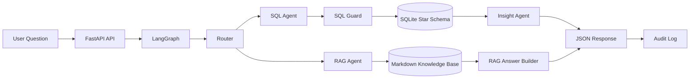

# AI BI Copilot

Local-first multi-agent BI copilot built with `FastAPI`, `LangGraph`, `SQLite`, and an offline `RAG`.

It lets a user ask business questions in natural language and automatically route the request to the right engine:

- `SQL` for analytical questions on structured data
- `RAG` for KPI definitions, business rules, and data documentation

This repository is designed as a portfolio-ready project: local, testable, readable, and easy to demo.

## Why This Project

Business users usually need two kinds of answers:

1. answers computed from data
2. answers grounded in business documentation

This project combines both in a single product flow with a local demo UI, short conversation memory, and traceable responses.

Examples:

- `Quel est le chiffre d'affaires par pays ?`
- `Quels sont les 10 meilleurs clients ?`
- `Comment calcule-t-on la marge ?`
- `Quelle est la difference entre Revenue et Margin ?`

## What It Does

- routes each question to the right path
- generates read-only SQL for common BI questions
- executes queries on a local SQLite star schema
- transforms SQL rows into business-friendly insights
- retrieves documentation from a local Markdown knowledge base
- returns grounded documentary answers with sources
- keeps short local conversation memory for follow-up questions
- exposes local history for recent interactions
- logs each interaction in a simple audit trail

## Current Architecture

```text
POST /api/chat
  -> FastAPI
  -> LangGraph
  -> Router
     -> SQL Agent -> SQL Guard -> SQLite -> Insight Agent
     -> RAG Agent -> knowledge_base -> answer with sources
  -> JSON response
```

The app also exposes a lightweight local demo UI at `/` for trying the project without going through Swagger first.

## Demo Snapshot

- local UI with SQL / RAG routing
- result summary cards
- inline visual reading for simple SQL outputs
- local interaction history by user

Screenshot area:

- future UI captures can be stored in `docs/assets/`

## Architecture Diagram



## Tech Stack

- Python
- FastAPI
- LangGraph
- SQLite
- Pytest
- local Markdown knowledge base

Optional integration code exists for Power BI / DAX, but the current V1 works fully locally.

## Key Capabilities

### 1. SQL analytics path

Supports deterministic local questions such as:

- total revenue
- revenue by country
- revenue by country for 2025 or 2026
- revenue by segment
- revenue by category
- top products by revenue
- top products by quantity
- top customers
- top Retail customers
- revenue by month
- revenue for 2025 or 2026
- margin by category
- margin by country
- margin by segment
- margin for 2025 or 2026

### 2. Local RAG path

Supports documentary questions such as:

- KPI definitions
- business rules
- data model descriptions
- customer segment explanations
- KPI synonyms such as `ASP` and `Gross Margin`
- differences between KPIs such as `Revenue`, `Cost`, and `Margin`
- country and category interpretation rules

### 3. Product-like local UX

- local UI at `/`
- route, sources, artifact, and audit visibility
- short conversation memory for follow-up questions such as `et en 2026 ?`
- local history endpoint and clickable history in the UI

### 4. BI data model

The demo database uses a simple star schema:

- `fact_sales`
- `dim_customer`
- `dim_product`
- `dim_date`

### 5. Safe local execution

- read-only SQL validation
- no required Internet access
- no required cloud model
- no required Azure setup for local V1

## Sample Questions

### Analytical questions

- `Quel est le chiffre d'affaires total ?`
- `Quel est le chiffre d'affaires par pays ?`
- `Quel est le chiffre d'affaires par pays en 2026 ?`
- `Quel est le chiffre d'affaires par segment ?`
- `Quel est le chiffre d'affaires par categorie ?`
- `Quel est le top 5 des produits par chiffre d'affaires ?`
- `Quel est le top 5 des produits en quantite ?`
- `Quels sont les clients Retail les plus performants ?`
- `Quels sont les 10 meilleurs clients ?`
- `Quelle est la marge par categorie ?`
- `Quelle est la marge par pays en 2026 ?`
- `Quelle est la marge par segment ?`
- `Quelle est la marge en 2025 ?`
- `Quel est le chiffre d'affaires par mois ?`

### Documentary questions

- `Comment calcule-t-on la marge ?`
- `Que signifie Revenue ?`
- `Que signifie Margin % ?`
- `Comment calcule-t-on l'ASP ?`
- `Que veut dire SMB ?`
- `Quelle est la difference entre Revenue et Margin ?`
- `Quelle est la difference entre Cost et Margin ?`
- `Qu'est-ce qu'un client Enterprise ?`
- `Comment definit-on un top customer ?`
- `Comment est defini un top product ?`
- `A quoi correspond le pays dans les analyses ?`
- `Quelles sont les regles metier ?`

## Example API Request

```json
{
  "question": "Quel est le chiffre d'affaires par pays ?",
  "user_id": "demo-user",
  "source": "auto"
}
```

## Example Response Types

### SQL route

```json
{
  "route": "sql",
  "answer": "Le Maroc affiche le chiffre d'affaires le plus eleve...",
  "sources": []
}
```

### RAG route

```json
{
  "route": "rag",
  "answer": "La marge correspond a la difference entre le chiffre d'affaires et le cout.",
  "sources": [
    "kpi_dictionary.md",
    "business_rules.md"
  ]
}
```

## Example Outputs

### Example 1 - SQL insight

Question:

`Quel est le chiffre d'affaires par pays ?`

Typical answer:

`Le Maroc affiche le chiffre d'affaires le plus eleve, suivi de l'Italie puis de l'Espagne.`

### Example 2 - Documentary answer

Question:

`Comment calcule-t-on la marge ?`

Typical answer:

`La marge correspond a la difference entre le chiffre d'affaires et le cout. Formule : Margin = Revenue - Cost.`

### Example 3 - Short documentary answer

Question:

`Que veut dire SMB ?`

Typical answer:

`SMB means small and medium-sized business. SMB customers are usually smaller than Enterprise customers but still represent business accounts.`

## Demo Walkthrough

A simple demo flow for interviews or portfolio review:

1. open `http://127.0.0.1:8000/`
2. verify `GET /health`
3. test a SQL question such as `Quel est le chiffre d'affaires par pays ?`
4. test another SQL question such as `Quel est le top 5 des produits en quantite ?`
5. test a year-filtered SQL question such as `Quel est le chiffre d'affaires en 2026 ?`
6. test a RAG question such as `Comment calcule-t-on l'ASP ?`
7. test a short documentary question such as `Que veut dire SMB ?`
8. show that the RAG answer returns sources
9. show the local history and follow-up behavior

Detailed walkthrough:

- `docs/DEMO_WALKTHROUGH.md`

## Project Structure

```text
app/
  agents/        # router, SQL agent, insight agent, graph
  api/           # FastAPI routes
  connectors/    # SQLite, schema metadata, optional Power BI connector
  core/          # config, audit, optional LLM wrapper
  models/        # request / response schemas
  rag/           # loader, retriever, local RAG compatibility layer
  tools/         # SQL guardrails
knowledge_base/  # KPI, data dictionary, business rules
scripts/         # demo database initialization
tests/           # local automated tests
docs/            # project and technical documentation
```

## Run Locally

Recommended runtime: `Python 3.11`

### PowerShell

```powershell
Set-Location C:\path\to\ai-bi-copilot
python -m venv .venv
.\.venv\Scripts\Activate.ps1
python -m pip install --upgrade pip
python -m pip install -r requirements.txt
Copy-Item .env.example .env
python scripts\init_demo_db.py
python -m uvicorn app.main:app --reload --host 127.0.0.1 --port 8000
```

Open:

- `http://127.0.0.1:8000/`
- `http://127.0.0.1:8000/docs`

Quick health check:

```powershell
Invoke-WebRequest http://127.0.0.1:8000/health
```

If virtual environment activation is blocked, use:

```powershell
.\.venv\Scripts\python.exe -m pip install -r requirements.txt
.\.venv\Scripts\python.exe scripts/init_demo_db.py
.\.venv\Scripts\python.exe -m uvicorn app.main:app --reload --host 127.0.0.1 --port 8000
```

## Local-Only Design

The current V1 is intentionally local-first:

- no Azure required
- no SQL Server required
- no Power BI environment required
- no Internet required for the main SQL and RAG flows

This makes the project easy to understand, test, and demonstrate.

## Documentation

- `docs/PROJECT_OVERVIEW.md`
- `docs/ARCHITECTURE.md`
- `docs/TECHNICAL_DOCUMENTATION.md`
- `docs/DOCUMENTATION_WORKFLOW.md`
- `docs/ROADMAP.md`
- `docs/DEMO_SCRIPT.md`
- `docs/DEMO_WALKTHROUGH.md`
- `docs/PRODUCT_NEXT_STEPS.md`
- `docs/V2_SCOPE.md`
- `CHANGELOG.md`

## What Makes It Interesting

This project is a good showcase of:

- API design with FastAPI
- workflow orchestration with LangGraph
- deterministic agent design
- BI-oriented SQL generation
- star schema modeling
- offline RAG on local business documentation
- readable testing for a multi-agent local system

## Status

Current state:

- local V1 working
- V2 lots 2 to 9 implemented
- SQL path working
- RAG path working
- local UI working
- short memory and history working
- `151` automated tests passing
- GitHub repository initialized and updated

## Notes

- This repository contains only local demo data and project documentation.
- No confidential production data is included.
- External integrations remain optional and are not required to run the local version.
